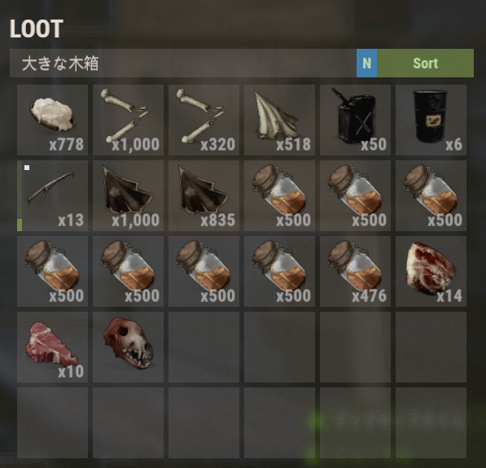

# おまる座RUSTサーバー Season.1

目次
<!-- TOC depthFrom:2 -->

- [おまる座RUSTサーバーとは](#おまる座rustサーバーとは)
- [特徴](#特徴)
- [使用MOD](#使用mod)
- [接続方法](#接続方法)
- [レイドについて](#レイドについて)
- [各機能の説明](#各機能の説明)
    - [パスワード認証](#パスワード認証)
    - [RemoverTool](#removertool)
    - [NoStability](#nostability)
    - [レイド保護](#レイド保護)
    - [ソートボタン](#ソートボタン)

<!-- /TOC -->

## おまる座RUSTサーバーとは
おまる座Discordメンバー用のRUSTサーバーです  

## 特徴
* 月1ワイプ（第一金曜23時）  
* パスワード認証による野良対策（[説明](#パスワード認証)）  
* マ〇クラ的建築の許可（[説明](#nostability)）
* 風化速度の緩和（通常時の25%減）
* 1日の長さの調整（昼40分、夜10分）  
* オフラインレイド保護機能（[説明](#レイド保護)）  
* 自身の建築物・設置物の自由な除去（[説明](#removertool)）  
* アイテムボックスのソートボタン（[説明](#ソートボタン)）  

## 使用MOD
* [Authentication](https://umod.org/plugins/authentication)
* [Time Of Day](https://umod.org/plugins/time-of-day)
* [Remover Tool](https://umod.org/plugins/remover-tool)
* [Better No Stability](https://umod.org/plugins/better-no-stability)
* [Raid Protection](https://umod.org/plugins/raid-protection)
* [No Decay](https://umod.org/plugins/no-decay)
* [Sort Button](https://umod.org/plugins/sort-button)

## 接続方法
接続先情報はDiscord参照  

> <span style="color:yellow">**初めて接続する方へ**</span>  
> 初めて接続する方はDiscordにてSteamの表示名を記載のうえ参加表明をお願いします  
> 確認が取れていない方の接続は確認が取れるまでBAN対象となります  

Steamの表示 ⇒ サーバーを選択  
  

サーバーを追加を選択  


Discordにピン留めされているIPアドレスを入力し、  
アドレスをお気に入りに追加  


RUSTのお気に入りサーバーに追加されるので接続  


## レイドについて
このサーバーでは本人への報告なしに無条件にレイドの開始を許可します  
（オフレイドについては[レイド保護](#レイド保護)にて説明）  
レイドはTCの破壊までを許可します  
TC破壊後にTCを配置して権利を獲得することは禁止とします  

## 各機能の説明

### パスワード認証
サーバーに接続後、パスワード認証が必要になります  
チャット欄に下記のコマンドにて認証してください  
```
/auth <パスワード>
```


### RemoverTool
チャット欄に以下のコマンドを打つと削除モードになります  
```
/remove
```
この状態で削除する建築物に対応したコスト(Price)を持った状態で左クリックで削除できるようになります  


### NoStability
このサーバーでは建築物の安定性を無視して建築ができるようになっています  
（マ〇クラのように足場を無限に伸ばすなど）  
ただし、地面に接地していない建築はできません（空中建築は不可）  

### レイド保護
シーズン１ではTC登録者全員がログアウト中は建築物へのダメージが無効*1になります  
つまり建物を殴ってみてダメージが入ったら所有者がオンライン＝レイドOKとなります  

*1: ダメージ無効になるのは最後のTC登録者がログアウトしてから60秒後

### ソートボタン
アイテムボックスのソートボタンを押すことでアイテムのソートができます  
